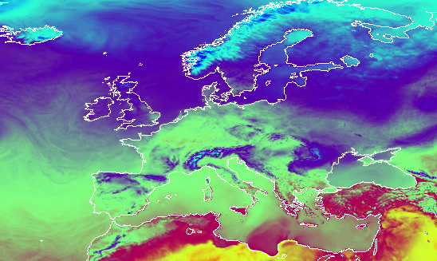

# Euroweather

This application downloads gridded weather forecasts covering Europe from [Deutscher Wetterdienst](https://www.dwd.de/) and stores then as sets of NetCDF files. The data spans from the start of the season (or later) and approximately 72 hours ahead of time. 

The files are suitable for calculating pest/disease risk maps for Europe.




&copy; 2024 [NIBIO](https://nibio.no/en) and [Met Norway](https://www.met.no/en)

Authors: Johannes Tobiassen Langvatn (Met Norway) and Tor-Einar Skog (NIBIO)

## License
```
 Copyright (c) 2024 NIBIO <https://www.nibio.no/> and Met Norway <https://www.met.no/>
 
 This program is free software: you can redistribute it and/or modify
 it under the terms of the GNU Affero General Public License as published by
 the Free Software Foundation, either version 3 of the License, or
 (at your option) any later version.
 
 This program is distributed in the hope that it will be useful,
 but WITHOUT ANY WARRANTY; without even the implied warranty of
 MERCHANTABILITY or FITNESS FOR A PARTICULAR PURPOSE.  See the
 GNU Affero General Public License for more details.
 
 You should have received a copy of the GNU Affero General Public License
 along with this program.  If not, see <http://www.gnu.org/licenses/>.
 
```

By using the hourly forecasts provided as [open data from Deutscher Wetterdienst (DWD)](https://www.dwd.de/EN/ourservices/opendata/opendata.html) and storing them as "historical weather data", we have synthetic weather data with 7 km resolution across the continent. 

The data are downloaded 4 times per day from [DWD](http://opendata.dwd.de/weather/nwp/icon-eu/grib/). The grib2 files are converted into NetCDF files containing 
only the parameters relevant for IPM Decisions. These are 

* Temperature (at 2m in &deg;C)
* Total precipitation (in mm)
* Relative humidity (at 2m in %)
* Wind speed (at 10m in m/s)


## Downloading and extracting data from Deutscher Wetterdienst (DWD)
The `python/` folder contains the operative and data files. The `run_eu` script downloads the data downloaded from DWD and collects them into grib2 files named `forecast_YYYYMMDDHH.grib2`. Then, `daily_archiver.py` converts the contents of the grib files into three sets of NetCDF files:

### daily_archive_YYYYMMDD.nc
These contain hourly values for the above mentioned parameters. The timezone is UTC. 

### daily_aggregated_YYYYMMDD.nc
These contain daily values for the following parameters:

* Temperature (at 2m in &deg;C): mean, minimum and maximum
* Total precipitation (in mmm)
* Relative humidity (at 2m in %): mean and maximum
* Wind speed (at 10m in m/s): mean

### YYYY.nc
This is a collection of all daily_aggregated_YYYYMMDD.nc for a year


## Configuring the system
### Software requirements
* Ubuntu Linux, tested with v 22
* Python3
* [Fimex](https://github.com/metno/fimex)

### Hardware requirements
* SSD (preferably) disk with at least 2TB of storage space (for one season worth of NetCDF weather data files)


#### Installing Fimex and Python requirements
Example using Ubuntu

``` bash
add-apt-repository ppa:met-norway/fimex
apt-get update
apt-get install --assume-yes fimex-1.6-bin fimex-1.6-share libfimex-1.6-0 python3-pyfimex0-1.6
```

From the root folder of the source code:

``` bash
sudo pip3 install -r requirements.xt
```

### Running the app
There are two processes that need to be run regularly
#### 1. The run_eu script
Should be run at least 4 times per day

An example of a crontab entry:
```bash
# m h  dom mon dow   command
30 * * * * cd /opt/Euroweather-backend/perl; ./run_eu > ./download.log
```

#### 2. daily_archiver.py
Should be run at least once per day, after the last daily data has been produced by DWD, so shortly after midnight.

An example of a crontab entry:
```bash
# m h  dom mon dow   command
0 1 * * * /opt/Euroweather-backend/python/daily_archiver.py
```


### Data maintenance
`daily_archiver.py` automatically generates new files - such as YYYY.nc, but it deletes nothing. The application mananger must archive data as they see fit.
